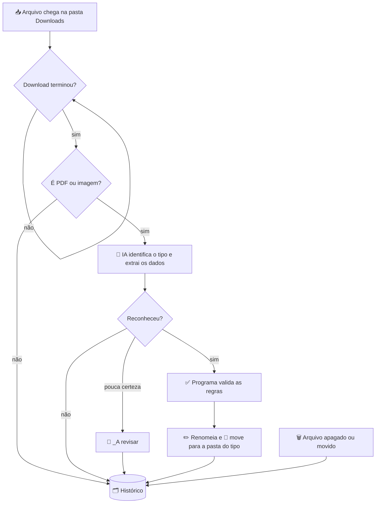

# WindowsOrganizer

> Um assistente que roda em segundo plano no Windows, organiza sua pasta **Downloads** sozinho e **lembra de tudo o que passou por ela**.

Você baixa uma folha de ponto, uma foto de atestado ou uma nota fiscal e não precisa fazer mais nada. O WindowsOrganizer **lê o documento com inteligência artificial**, entende o que ele é, **renomeia** com as informações importantes (nome da pessoa, mês, data…), **confere se os dados estão corretos** e **guarda na pasta certa**. Tudo fica registrado num histórico local que você pode consultar depois.

> 🚧 **Projeto em desenvolvimento.** A primeira versão já funciona. Veja o [Roadmap](#-roadmap) para o que vem pela frente.

---

## 📌 Sumário

- [O problema](#-o-problema)
- [O que o app faz](#-o-que-o-app-faz)
- [Exemplos](#-exemplos)
- [Como funciona por dentro](#-como-funciona-por-dentro)
- [Tipos de documento](#-tipos-de-documento)
- [Regras de validação](#-regras-de-validação)
- [Histórico](#-histórico)
- [Privacidade e custos](#-privacidade-e-custos)
- [Instalação](#-instalação)
- [Estrutura do projeto](#-estrutura-do-projeto)
- [Roadmap](#-roadmap)

---

## 🎯 O problema

A pasta Downloads vira um depósito: `documento (3).pdf`, `IMG_20260812_0931.jpg`, `folha_ponto_export.pdf`… Encontrar a folha de ponto de um funcionário de três meses atrás, ou saber se um atestado já foi recebido, vira uma busca manual. E erros de exportação, como uma folha de ponto gerada com o período errado, só são percebidos muito depois.

O WindowsOrganizer resolve isso **no momento em que o arquivo chega**.

---

## ✨ O que o app faz

| | Funcionalidade | Descrição |
|---|---|---|
| 👀 | **Monitoramento contínuo** | Vigia a pasta Downloads em tempo real e espera o download terminar antes de mexer no arquivo. |
| 🧠 | **Leitura com IA** | Lê PDFs (inclusive escaneados) e imagens (fotos de documentos, até manuscritos) e identifica o tipo do documento. |
| ✏️ | **Renomeação inteligente** | Monta o nome do arquivo com os dados extraídos: `João Silva - 2026-08.pdf`. |
| 📁 | **Organização automática** | Move o documento para a pasta do tipo dele (`Folhas de Ponto`, `Atestados`…). |
| ✅ | **Validação de dados** | Confere regras que você define (ex.: período da folha de ponto) e marca no nome do arquivo quando algo está errado. |
| 🗂️ | **Histórico completo** | Registra tudo o que chegou, foi organizado, renomeado, movido ou **apagado**. |
| 🎓 | **Aprende com exemplos** | Você mostra um documento de exemplo e a IA configura sozinha um novo tipo de documento. |
| 🔔 | **Notificações** | Avisa perto do relógio do Windows quando organiza algo ou encontra um problema. |
| 🛟 | **Segurança em caso de dúvida** | Se a IA não tem certeza, o arquivo vai para `_A revisar` em vez de ir para o lugar errado. |

---

## 📸 Exemplos

**O que chega na pasta → o que o app faz:**

| Arquivo que chegou | Resultado |
|---|---|
| `espelho_ponto.pdf` (período 19/07 a 18/08) | `Folhas de Ponto\João Silva - 2026-08.pdf` |
| `export (2).pdf` (período 01/07 a 31/07) | `Folhas de Ponto\Maria Souza - 2026-07 - FOLHA COM DATA ERRADA.pdf` ⚠️ |
| `IMG_0931.jpg` (foto de atestado) | `Atestados\Pedro Lima - 2026-09-10.jpg` |
| `fatura.pdf` (boleto, sem tipo cadastrado) | Fica onde está, com um resumo no histórico: *"Boleto de energia elétrica"* |
| `setup.exe`, `fotos.zip` | Ficam onde estão e são registrados no histórico |
| Arquivo apagado por você | Registrado como **apagado**, com data e hora |

No caso da folha com erro, o histórico explica o motivo:
> *Fim do período é 31/07/2026, esperado dia 18. Início do período é 01/07/2026, esperado 19/06/2026.*

---

## ⚙️ Como funciona por dentro



Um princípio importante do projeto:

> **A IA lê. O programa confere.**
>
> A inteligência artificial só **extrai** as informações do documento, transcrevendo o que está escrito. Quem **valida** as datas é o próprio código, com regras fixas e previsíveis. Assim, a detecção de erros é 100% confiável e não depende da IA "achar" que algo está certo.

Outros detalhes:
- **Nada é analisado duas vezes.** O resultado da IA fica guardado pelo conteúdo do arquivo, então o mesmo documento não gera custo de novo.
- **Varredura periódica.** Além de vigiar em tempo real, o app compara a pasta com o histórico de tempos em tempos e percebe o que mudou enquanto ele estava fechado.
- **Primeira execução não mexe em nada.** Os arquivos que já estavam na pasta são apenas registrados. Para organizá-los também, há um botão para isso.

---

## 📄 Tipos de documento

Cada tipo de documento tem:

| Configuração | Exemplo (Folha de ponto) |
|---|---|
| **Nome** | Folha de ponto |
| **Como reconhecer** | Folha/espelho de ponto com registros de entrada e saída dia a dia… |
| **Instruções à IA** | O período aparece no cabeçalho… |
| **Campos a extrair** | `nome` (texto), `data_inicio` (data), `data_fim` (data) |
| **Modelo do nome** | `{nome} - {mes_referencia}` |
| **Pasta de destino** | Folhas de Ponto |
| **Regras** | Período de 19 do mês anterior a 18 do mês de referência |

O app já vem com **Folha de ponto** e **Atestado médico** configurados.

### 🎓 Aprender com exemplo

Não é preciso configurar tudo à mão. Na aba **Tipos de documento**:

1. Clique em **Aprender com exemplo…** e escolha um documento (ex.: um holerite).
2. Se quiser, escreva uma orientação: *"quero o nome com o CNPJ do fornecedor"* ou *"o período começa dia 19 do mês anterior e termina dia 18"*.
3. A IA analisa o documento e **preenche a configuração inteira**: nome, descrição, campos, modelo do nome, pasta e regras.
4. Você revisa, ajusta se quiser e clica em **Salvar**.

A partir daí, todo documento desse tipo que chegar será organizado automaticamente.

---

## ✅ Regras de validação

| Regra | O que confere | Exemplo |
|---|---|---|
| **Período de referência** | Se o documento começa e termina nos dias certos. Também gera o campo `{mes_referencia}`. | Folha de ponto: 19 do mês anterior → 18 do mês de referência |
| **Data não futura** | Se uma data não está no futuro (sinal de erro de digitação ou leitura). | Data do atestado |
| **Dados incompletos** *(automática)* | Se todos os campos usados no nome foram encontrados. | Atestado sem o nome do paciente |

Quando uma regra falha, o arquivo é organizado mesmo assim, mas **com um aviso no nome** (texto configurável, ex.: `FOLHA COM DATA ERRADA`) e o motivo detalhado no histórico.

---

## 🗂️ Histórico

Tudo fica gravado localmente num banco SQLite e pode ser consultado na aba **Histórico**, com busca por texto e filtro por tipo de evento:

| Evento | Significado |
|---|---|
| `organizado` | Documento reconhecido, renomeado e movido |
| `revisar` | IA com pouca certeza: enviado para `_A revisar` |
| `nao_reconhecido` | Documento lido, mas não corresponde a nenhum tipo (com resumo do conteúdo) |
| `novo` | Arquivo que não é documento (ex.: `.exe`, `.zip`) chegou |
| `apagado` | Arquivo foi excluído |
| `movido` / `renomeado` | Você moveu ou renomeou um arquivo |
| `erro` | Algo deu errado (ex.: sem internet), e o app tenta de novo depois |
| `inventario` | Registro inicial dos arquivos que já existiam |

Dê um duplo clique num evento para ver todos os dados extraídos e abrir o arquivo no Explorer.

---

## 🔒 Privacidade e custos

**Onde ficam os dados:** tudo fica no seu computador, em `%LOCALAPPDATA%\WindowsOrganizer\`:

| Arquivo | Conteúdo |
|---|---|
| `historico.db` | Histórico de eventos |
| `tipos.json` | Tipos de documento |
| `config.json` | Configurações |
| `app.log` | Log técnico para diagnóstico |

A **chave da API** fica no **Gerenciador de Credenciais do Windows**, nunca num arquivo de texto.

**O que sai do computador:** para identificar um documento, o arquivo (no máximo as primeiras páginas) é enviado à API da Anthropic (Claude). A Anthropic não usa dados enviados pela API para treinar seus modelos. Arquivos que não são PDF nem imagem nunca são enviados.

**Custo estimado por documento** (API paga, sem mensalidade):

| Modelo | Perfil | Custo aproximado |
|---|---|---|
| Claude Opus 5 *(padrão)* | Mais preciso, melhor com manuscritos | R$ 0,10 – 0,25 |
| Claude Sonnet 5 | Equilíbrio | R$ 0,04 – 0,10 |
| Claude Haiku 4.5 | Mais barato | R$ 0,02 – 0,05 |

O modelo pode ser trocado a qualquer momento em **Configurações**.

---

## 🚀 Instalação

**Requisitos:** Windows 10/11, Python 3.11 ou mais recente e uma chave da API da Anthropic ([console.anthropic.com](https://console.anthropic.com)).

```bash
git clone https://github.com/ZxDrawn/WindowsOrganizer.git
cd WindowsOrganizer
python -m pip install -r requirements.txt
pythonw main.py
```

Na primeira abertura:
1. Vá em **Configurações**, cole a chave da API e clique em **Salvar configurações**.
2. Marque **Iniciar junto com o Windows** para o app rodar sempre em segundo plano.
3. Pronto: baixe um documento e acompanhe na aba **Histórico**.

O app fica no ícone perto do relógio do Windows. Fechar a janela **não** encerra o programa. Para sair, clique com o botão direito no ícone e escolha **Sair**. Pelo mesmo menu dá para **pausar** a organização ou **varrer a pasta agora**.

---

## 🧱 Estrutura do projeto

```
WindowsOrganizer/
├── main.py              # Ponto de entrada: ícone na bandeja, instância única
├── requirements.txt
└── organizer/
    ├── config.py        # Configurações e tipos de documento padrão
    ├── engine.py        # Motor: vigia a pasta, processa, move, detecta exclusões
    ├── ai.py            # Integração com o Claude (identificar e aprender tipos)
    ├── rules.py         # Regras de validação determinísticas
    ├── db.py            # Histórico e cache (SQLite)
    └── gui.py           # Janela: Histórico, Tipos de documento, Configurações
```

**Tecnologias:** Python · [Anthropic SDK](https://github.com/anthropics/anthropic-sdk-python) · watchdog · SQLite · Tkinter · pystray · pypdf · Pillow · keyring

---

## 🗺️ Roadmap

A ideia é que o WindowsOrganizer deixe de ser só um "organizador de pastas" e vire um **assistente que conhece seus documentos**.

### 🔜 Próximos passos
- [ ] **IA local e gratuita (modo híbrido):** usar um modelo rodando no próprio PC (via Ollama) para os casos simples e chamar o Claude só quando o modelo local não tiver certeza. Menos custo e mais privacidade.
- [ ] **Leitura de texto direto do PDF:** folhas exportadas de sistema já têm texto e não precisam de "visão", o que deixa tudo mais rápido e barato.
- [ ] **Executável (.exe) com instalador:** instalar sem precisar do Python.
- [ ] **Testes automatizados** das regras e do motor.

### 💬 Perguntar ao histórico
- [ ] Busca em linguagem natural: *"quais atestados do João chegaram em agosto?"*, *"o que foi apagado semana passada?"*, *"já recebi a folha de ponto da Maria de setembro?"*.

### 📊 Controle e pendências
- [ ] **Painel de pendências:** saber quais funcionários ainda não têm folha de ponto do mês.
- [ ] **Detecção de duplicados:** avisar quando o mesmo documento (ou uma nova versão dele) chega mais de uma vez.
- [ ] **Relatórios mensais:** resumo do que foi recebido, organizado e o que teve problema.
- [ ] **Alertas:** ex.: atestado com muitos dias de afastamento ou documento vencido.

### 🧩 Mais flexibilidade
- [ ] **Mais tipos de regra:** valores numéricos, CPF/CNPJ válidos, campos obrigatórios, comparação entre documentos.
- [ ] **Regras escritas em português:** descrever a regra em texto (*"o holerite deve ser do mês anterior"*) e o app convertê-la em uma regra verificável.
- [ ] **Várias pastas monitoradas** (Downloads, Área de Trabalho, pasta de e-mails…).
- [ ] **Subpastas dinâmicas:** ex.: `Folhas de Ponto\2026\08 - Agosto\`.
- [ ] **Desfazer:** botão para devolver um arquivo ao nome e local originais.
- [ ] **Exportar o histórico** para Excel/CSV.

### 🌐 Mais adiante
- [ ] Integração com OneDrive/Google Drive para organizar direto na nuvem.
- [ ] Receber documentos por e-mail e organizá-los da mesma forma.
- [ ] Versão multiusuário para equipes de RH/DP, com histórico compartilhado.

---

## 🤝 Contribuindo

Sugestões e ideias são bem-vindas! Abra uma [issue](https://github.com/ZxDrawn/WindowsOrganizer/issues) descrevendo o tipo de documento ou a funcionalidade que você gostaria de ver.
